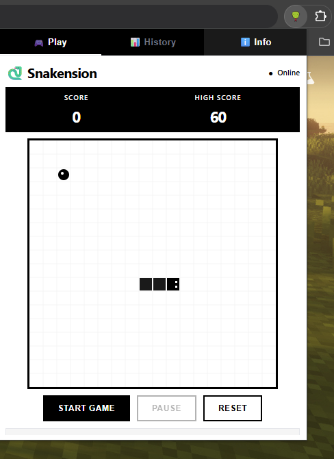
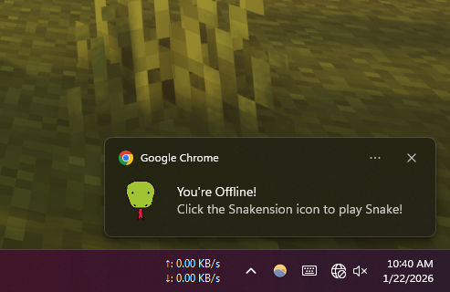

# Snakension 

A browser extension to play Snake anytime, especially when you're offline!

### ^_^ Visit Docs [Click Here](./docs/index.html)

**Notifies you when you're offline to play this game.**

## 📦 Installation

Follow these simple steps to add **Snakension** to your browser (Chrome, Edge, or Brave):

1. Download the [Zip File](https://github.com/iamovi/snakension/releases/latest) from latest releases.
- or [click here](https://github.com/iamovi/snakension/releases/download/snakensiom/snakension.zip) to download.
2. Open your browser and go to the **Extensions** page:
   - Chrome: `chrome://extensions/`
   - Edge: `edge://extensions/`
   - Brave: `brave://extensions/`
   - or manually by navigating to extensions page in your browser.
   - **Then unzip the file**
3. Enable **Developer mode** (usually a toggle in the top-right corner).
4. Click the **Load unpacked** button.
5. Select the `snakension` folder you just downloaded.

That's it! You can now access the game from your extensions toolbar.

## ✨ Features

- **Offline Mode**: Automatically send notifications to play this game when you're offline.
- **Save High Score**: Keeps track of your best performance.
- **Responsive Controls**: Smooth gameplay with multiple control options.
- **Clean UI**: Beautiful and simple design.

---

Under [MIT License](./LICENSE)

Enjoy your game! 🍎
